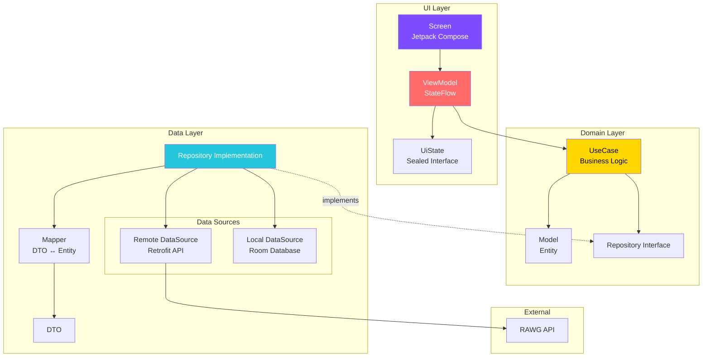

# GameLibrary App
Rawg Apiを用いたゲーム情報を取得できるアプリケーションです。ユーザーの視認性と操作性を重視して構築しました。


    

## Features（主要機能）
- DiscoveryScreen, SectionDetailScreen
  - 「Trending」「High Rated」「New Release」の3つのセクションから注目すべきゲームの発見
    - Trending Games (トレンドゲーム)
    - High Rated Games (高評価ゲーム)
    - New Release Games (新作ゲーム)
- SearchScreen
  - タイトル入力により目的のゲームを特定
- FavoriteScreen
  - お気に入り機能により、気になるゲームをローカルDB（Room）へ保存
- DetailScreen
  - 評価、発売日、対応プラットフォームなど、ゲームの情報を取得

## Screenshots

|DiscoveryScreen|SectionDetailScreen|DetailScreen|
|---|---|---|
||||
|SearchScreen|FavoriteScreen||
||||

## Architecture
Clean Architecture + MVVM
GameLibraryはClean ArchitectureとMVVM（Model-View-ViewModel）パターンを組み合わせた設計を採用している。
Data、Domain、UIの3層に明確に分離することで、テスタビリティ、保守性、スケーラビリティを実現した。


本プロジェクトでは、Clean Architecture の原則に基づいたレイヤー分離と、MVVM (Model-View-ViewModel) パターンを採用している。
これにより、各コンポーネントの責務を明確にし、テストの容易性とコードの再利用性を高めた。

## 📁 Project Structure
本プロジェクトは、関心の分離と高い保守性を実現するため、以下のパッケージ構造を採用している

<details>
<summary>📁 プロジェクト構造の詳細を表示 (クリックで開閉)</summary>

```text
app/
├── src/
│   ├── main/
│   │   ├── kotlin/com/lilin/gamelibrary/
│   │   │   ├── GameLibraryApplication.kt
│   │   │   │
│   │   │   ├── data/                      # Data Layer
│   │   │   │   ├── api/                   # API Service interfaces
│   │   │   │   │   └── GameApiService.kt
│   │   │   │   ├── dto/                   # Data Transfer Objects
│   │   │   │   │   ├── GameDto.kt
│   │   │   │   │   └── GameListResponse.kt
│   │   │   │   ├── local/                 # Local Database
│   │   │   │   │   ├── dao/
│   │   │   │   │   ├── database/
│   │   │   │   │   └── entity/
│   │   │   │   ├── mapper/                # DTO ↔ Entity mappers
│   │   │   │   │   └── GameMapper.kt
│   │   │   │   └── repository/            # Repository implementations
│   │   │   │       └── GameRepositoryImpl.kt
│   │   │   │
│   │   │   ├── domain/                    # Domain Layer
│   │   │   │   ├── model/                 # Business entities
│   │   │   │   │   ├── Game.kt
│   │   │   │   │   └── GameDetail.kt
│   │   │   │   ├── repository/            # Repository interfaces
│   │   │   │   │   └── GameRepository.kt
│   │   │   │   └── usecase/               # Business logic
│   │   │   │       ├── GetTrendingGamesUseCase.kt
│   │   │   │       ├── GetHighMetacriticScoreGamesUseCase.kt
│   │   │   │       └── GetNewReleasesUseCase.kt
│   │   │   │
│   │   │   ├── feature/                   # Feature modules (UI Layer)
│   │   │   │   ├── discovery/             # Discovery screen
│   │   │   │   │   ├── DiscoveryScreen.kt
│   │   │   │   │   ├── DiscoveryViewModel.kt
│   │   │   │   │   └── DiscoveryUiState.kt
│   │   │   │   ├── sectiondetail/         # Section detail screen
│   │   │   │   │   ├── SectionDetailScreen.kt
│   │   │   │   │   ├── SectionDetailViewModel.kt
│   │   │   │   │   └── SectionDetailUiState.kt
│   │   │   │   ├── detail/                # Game detail screen
│   │   │   │   ├── search/                # Search screen
│   │   │   │   └── favorite/              # Favorite screen
│   │   │   │
│   │   │   ├── ui/                        # Shared UI components
│   │   │   │   ├── component/             # Reusable components
│   │   │   │   │   ├── discovery/         # Discovery-specific components
│   │   │   │   │   ├── sectiondetail/     # Section detail components
│   │   │   │   │   └── ...
│   │   │   │   ├── theme/                 # App theme & styling
│   │   │   │   │   ├── Color.kt
│   │   │   │   │   ├── Theme.kt
│   │   │   │   │   └── Type.kt
│   │   │   │   ├── GameLibraryApp.kt      # App composition root
│   │   │   │   └── MainActivity.kt
│   │   │   │
│   │   │   ├── navigation/                # Navigation graph
│   │   │   │   ├── GameLibraryNavHost.kt
│   │   │   │   └── TopLevelDestination.kt
│   │   │   │
│   │   │   └── di/                        # Dependency Injection
│   │   │       ├── NetworkModule.kt
│   │   │       ├── DatabaseModule.kt
│   │   │       └── RepositoryModule.kt
│   │   │
│   │   └── res/                           # Resources
│   │       ├── values/
│   │       ├── drawable/
│   │       └── ...
│   │
│   └── test/                              # Unit & Screenshot tests
│       └── kotlin/com/lilin/gamelibrary/
│           ├── feature/
│           │   ├── discovery/
│           │   │   ├── DiscoveryViewModelTest.kt
│           │   │   └── DiscoveryScreenShotTest.kt
│           │   └── ...
│           └── ui/component/
│               └── ...
│
├── build.gradle.kts
└── ...
```
</details>

#### Key Directories

| Directory | Purpose |
| :--- | :--- |
| `data/` | **データアクセス層** - API通信、DB操作、Repository実装 |
| `domain/` | **ビジネスロジック層** - Entity、UseCase、Repository interface |
| `feature/` | **画面単位のUI実装** - Screen、ViewModel、UiState |
| `ui/component/` | **再利用可能なUIコンポーネント** |
| `ui/theme/` | **アプリ全体のテーマとデザインシステム** |
| `navigation/` | **画面遷移の定義** |
| `di/` | **Hiltによる依存性注入の設定** |

## Technical Highlights
1. Roborazzi + Robolectric によるスクリーンショットテスト 
   1. UI regression testingを自動化し、視覚的な品質を保証する包括的なテスト戦略を実装
       **実装例:**
       ```kotlin
       @Test
       fun discoveryScreen_successState_captureScreenshot() {
           composeTestRule.setContent {
               GameLibraryTheme {
                   DiscoveryScreenSample(
                       trendingState = DiscoveryUiState.Success(games),
                       highlyRatedState = DiscoveryUiState.Success(games),
                       newReleasesState = DiscoveryUiState.Success(games),
                   )
               }
           }
           composeTestRule.onRoot().captureRoboImage()
       }
       ```
   2. **導入効果:**
       - UIの意図しない変更を自動検知
       - リファクタリングの安全性向上
       - デザインレビューの効率化
       - CI/CDパイプラインでの視覚的回帰テスト
2. アニメーション実装
   1. ユーザー体験を向上させる、アニメーション
      1. Grid ⇔ List 表示切替アニメーション
      2. 画面遷移アニメーション
         1. **BottomBar ナビゲーション:**
            - 左右方向のスライドアニメーション
            - 現在地を直感的に把握できるようにスライドアニメーションを実装
         2. **詳細画面への遷移**
            - Material 3ガイドラインに準拠したFade遷移の採用

## Tech Stack（技術スタック）
- UI: Jetpack Compose (Material 3), Coil 3 (最新のマルチプラットフォーム対応版), Shimmer
- Dependency Injection: Hilt
- Networking: Retrofit 3, OkHttp 4, Kotlinx Serialization
- Database: Room
- Async: Kotlin Coroutines, Flow (StateFlow / SharedFlow)
- Testing:
  - JUnit 5 
  - Roborazzi & Robolectric: スクリーンショットテストによるUI回帰テストの自動化 
  - MockK & Turbine: Flowの振る舞い検証とモック作成 
  - Static Analysis (CI/CD): Detekt (Compose Rules)


